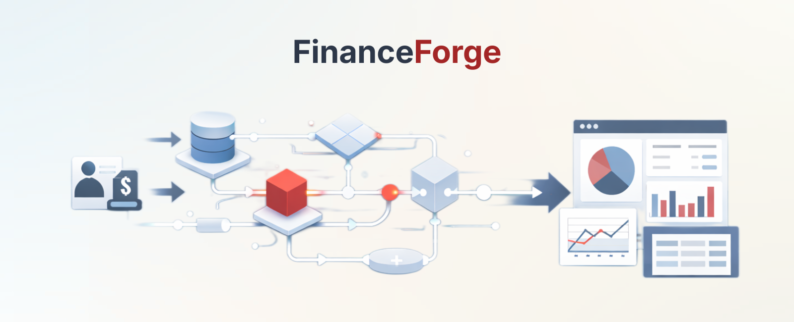

<p align="center">
  
</p>

# FinanceForge

A backend-first personal finance management API built with Spring Boot 3.5.8 and Java 21. FinanceForge demonstrates rigorous domain modeling, transactional correctness, and clean architectural boundaries in a financial domain context.

## Project Overview

FinanceForge is a RESTful API for managing personal financial data: accounts, transactions, budgets, and recurring expenses. The system enforces double-entry bookkeeping principles, maintains referential integrity across related entities, and ensures correct balance calculations under concurrent access.

This project demonstrates how to build backend systems correctly: domain-driven design, strict validation, atomic updates, and audit-friendly workflows are first-class concerns.

## Why This Project Exists

Many personal finance applications compromise on data integrity for speed or simplicity. FinanceForge shows that correctness and maintainability can coexist with practical development:

- **Transactional Consistency**: Account balances and budgets are updated atomically. Failed operations leave no partial state.
- **Domain-Driven Design**: Business rules live in service layers; controllers orchestrate, not dictate.
- **Explicit State Management**: Budget periods, recurring expenses, and month-end rollovers are explicit, auditable, and idempotent.
- **Professional Development Practices**: Branching strategies, commit conventions, and code organization mirror enterprise standards.

## Tech Stack

- **Language**: Java 21
- **Framework**: Spring Boot 3.5.8
- **Build Tool**: Gradle with Kotlin DSL
- **Database**: PostgreSQL 15+
- **ORM**: JPA / Hibernate
- **Testing**: JUnit 5, Mockito, Testcontainers
- **API Style**: REST (JSON)
- **Architecture**: Layered architecture with separation between domain, persistence, service, and API layers

## Domain Model Highlights

### Core Entities

- **Account**: Tracks all financial accounts (checking, savings, credit cards, investments). Balances are derived from transaction history.
- **Transaction**: Represents income, expenses, and transfers. Ensures atomic updates and maintains audit logs.
- **Budget**: Defines spending limits by category per period. Tracks utilization and enforces overspending rules.
- **RecurringExpense**: Templates for predictable recurring transactions. Linked to generated transactions for audit purposes.

### Key Design Decisions

- **Balance Calculation**: Derived from transaction history, never manually updated
- **Budget Period Management**: Month-end rollover is explicit and auditable
- **Transaction Atomicity**: Managed via Spring `@Transactional` across services
- **Enum-Driven Types**: Account types, transaction types, budget categories, and recurring frequencies are enums for type safety

## MVP Capabilities

### Account Management
Create accounts with starting balances, track current balances derived from transaction history, support multiple account types, and safely close accounts with validation to prevent orphaned transactions.

### Transaction Processing
Record income, expenses, and transfers with atomic updates. Validate sufficient funds for transfers and expense transactions. Filter transactions by date range, account, category, and type.

### Budget Tracking
Create and track monthly budgets by category. Calculate utilization percentages in real-time. Automatically identify over-budget categories with spending alerts.

### Recurring Expenses
Define templates for recurring expenses (weekly, monthly, quarterly, yearly). Generate transactions automatically based on schedule. Activate or deactivate recurring expenses without deletion.

### Month-End Operations
Close budget periods and create new ones. Generate recurring expenses for the new period. Produce period summary calculations with full audit trails. Idempotent execution prevents duplicate processing.

### REST API
Full CRUD operations for all entities with proper HTTP semantics (201 for creation, 204 for deletion, 404 for not found). Request and response DTOs separate external contracts from internal domain models. Pagination and sorting support for large datasets.

## Development Workflow

### Branching Strategy

- **`main`**: Production-ready code only. All merges are squash-merged and tagged.
- **`develop`**: Integration branch; base for all feature branches.
- **`feature/FF-###-description`**: Feature branches linked to ticket IDs.

### Git Workflow

1. Create a ticket for the feature or fix
2. Branch from `develop`:
   ```bash
   git checkout develop
   git pull origin develop
   git checkout -b feature/FF-123-add-budget-endpoint
   ```

3. Implement changes with conventional commits:
   ```
   feat(budget): add budget creation endpoint
   fix(account): resolve balance calculation bug
   docs(readme): update setup instructions
   ```

4. Push branch and open PR to `develop`
5. After review, squash-merge to `develop`
6. Periodically merge `develop` to `main` with release tags

## Local Setup

### Prerequisites

- Java 21 JDK
- Gradle 8.x
- PostgreSQL 15+
- Git

### Installation

1. Clone the repository:
   ```bash
   git clone https://github.com/ProgrammingWithTyler/FinanceForge.git
   cd FinanceForge
   ```

2. Create the database:
   ```bash
   createdb financeforge_dev
   ```

3. Update `src/main/resources/application.yml` with your database credentials:
   ```yaml
   spring:
     datasource:
       url: jdbc:postgresql://localhost:5432/financeforge_dev
       username: your_username
       password: your_password
   ```

4. Build the project:
   ```bash
   ./gradlew build
   ```

5. Run the application:
   ```bash
   ./gradlew bootRun
   ```

API available at `http://localhost:8080`

### Running Tests

```bash
./gradlew test
```

## Project Status

- **Current Phase**: Service layer implementation (Phase 3)
- **Domain Entities**: ✅ Complete
- **Persistence Layer**: In progress
- **Service Layer**: In progress
- **API Layer**: Planned
- **MVP Progress**: 5 of 21 core tickets completed

## Planned Enhancements

- Migrate to RedQuery ORM for advanced query capabilities
- Add comprehensive validation layer with custom business rules
- Implement reporting endpoints for budgets, accounts, and transactions
- Enhance testing suite with integration and end-to-end coverage
- Optimize query performance and eliminate N+1 queries

## Contributing

This is a solo-developer portfolio project. External contributions are not currently accepted.

## License

This project is licensed under the BSD 3-Clause License - see the LICENSE file for details.

## Contact

**GitHub**: [@ProgrammingWithTyler](https://github.com/ProgrammingWithTyler)

---

*Built to demonstrate professional backend engineering practices in a complex financial domain.*
